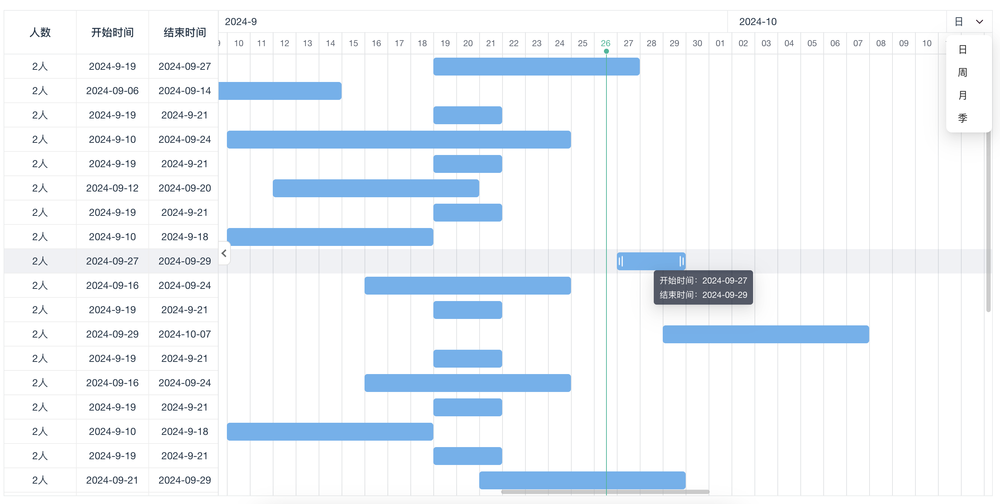

# gantt-custom

它是基于vue3开发的一款甘特图UI库；



## 安装：

```bash\
npm install gantt-custom
```

## 用法：

### 引入组件:

```js
import {
  Gantt,
  type GanttDataProps,
  type GanttHeadProps,
  type GanttRefProps,
} from 'gantt-custom'
```

**注意：需要单独引入样式文件** 

```js
import 'gantt-custom/style.css'
```

相关类型定义：

```ts
export type GanttType = 'day' | 'week' | 'month' | 'quarter';

export interface GanttDataProps {
  startTime: string; // 开始时间
  endTime: string; // 结束时间
  id: string; //
  [key: string]: any; // 其它数据不做限制
}

export interface GanttHeadProps {
  fieldName: string // 字段名
  fieldTag: string // 字段标签 类似id
  width?: string;
  key?: string;
  align?: 'center' | 'left' | 'right'; // 排列方式
  [key: string]: any; // 其它自定义header
}

export interface GanttProps {
  /**
   * 数据
   */
  data: GanttDataProps[];
  /**
   * 表头
   */
  head?: GanttHeadProps[];
  /**
   * 时间展示维度：日、周、月、季
   */
  ganttType?: GanttType;
  /**
   * 高度： 甘特图 跟元素容器高度
   */
  height?: string;
  /**
   * 是否显示左侧收起按钮
   */
  open?: boolean;
}
```

### 事件：

| 事件名            | 功能介绍                                   |
| ----------------- | ------------------------------------------ |
| onDateChange      | 回调：拖拽改变时间，开始、结束、整个时间轴 |
| onDataClick       | 点击数据回调                               |
| onGanttTypeChange | 修改时间维度：日、周、月、季               |

### demo

```vue
<script setup lang="ts">
import { ref, onMounted } from 'vue'
// 引入组件
import {
  Gantt,
  type GanttDataProps,
  type GanttHeadProps,
  type GanttRefProps,
} from 'gantt-custom'
// 注意：需要单独引入样式文件 
import 'gantt-custom/style.css'

// table header
const head: GanttHeadProps[] = [
  {
    fieldName: "人数",
    fieldTag: "num",
    width: '100px',
  },
  {
    fieldName: "开始时间",
    fieldTag: "startTime",
    width: '100px',
  },
  {
    fieldName: "结束时间",
    fieldTag: "endTime",
    width: '100px',
  },
]
// 数据
const list = ref<GanttDataProps[]>([]);
const ganttRef = ref<GanttRefProps>()
const ganttType = ref('day')

// 生成唯一id
function getUUID() {
  let uuid = '';
  const hexDigits = '0123456789abcdef';
  for (let i = 0; i < 36; i++) {
    if (i === 8 || i === 13 || i === 18 || i === 23) {
      uuid += '-';
    } else if (i === 14) {
      uuid += '4';
    } else {
      const randomDigit = Math.floor(Math.random() * 16);
      uuid += hexDigits[i === 19 ? (randomDigit & 0x3) | 0x8 : randomDigit];
    }
  }
  return uuid;
}
// 拖拽结束：修改时间轴数据
const onDateChange = (params: any) => {
  console.log('onDateChange', params);
  list.value = list.value.map((item: GanttDataProps) => {
    if (item.id == params.id) {
      return {
        ...item,
        startTime: params.startTime,
        endTime: params.endTime,
      }
    }
    return item
  })
}
const onDataClick = (params: any) => {
  console.log('onDataClick', params);
  alert('点击了')
}
// 切换甘特图时间维度
const onGanttTypeChange = (type: string) => {
  ganttType.value = type
}
// 异步获取数据
const getData = () => {
  setTimeout(() => {
    list.value = [1,1,1,1,1,1,1,1,1,1,1,1,1,1,1,1,1,1,1,1,1,1,1,1,1,1,1,1,1,2,3].map((item, index) => {
      return {
        startTime: index % 2 == 1 ? "2024-9-10" : '2024-9-19',
        endTime: index % 2 == 1 ? "2024-9-18" : '2024-9-21',
        finishTime: null,
        dept: "技术部",
        num: "2人",
        time: "2天",
        start: true,
        time2: "结束时间",
        id: getUUID()
      }
    })
  });
}

onMounted(() => {
  getData()
})
</script>

<template>
  <div class="app-wrapper">
    <Gantt
      :head="head"
      :data="list"
      :ganttType="ganttType"
      height="100%"
      @onDateChange="onDateChange"
      @onDataClick="onDataClick"
      @onGanttTypeChange="onGanttTypeChange"
    />
  </div>
</template>
```


